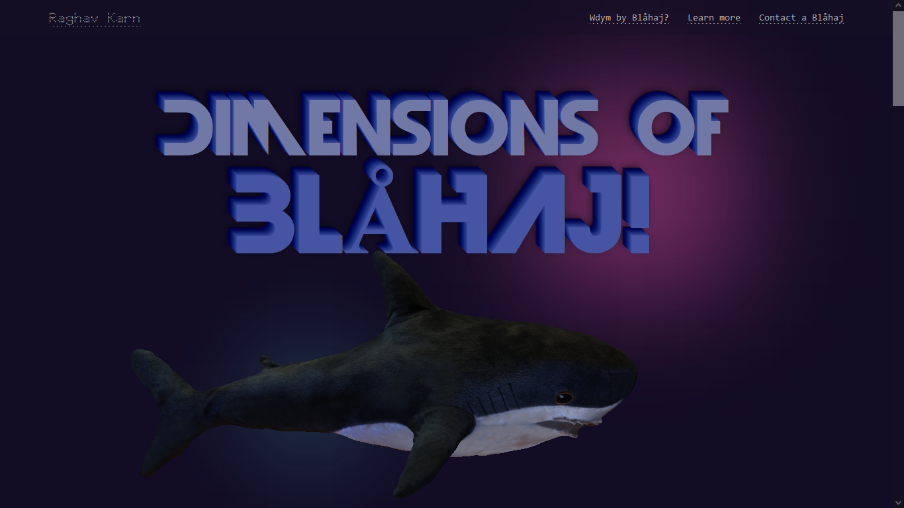

# `Dimensions of Blåhaj` 🦈
Welcome to the [**Dimensions of Blåhaj**](https://raghav-karn.github.io/blahaj)
A [Fraps](https://fraps.hackclub.com/) project.

**Disclaimer**: Some elements may look not as intended on smaller devices. Desktop device is recommended.

## Overview ✨
**Dimensions of Blåhaj** is a Blåhaj-dedicated landing page, featuring a 3D Blְåhaj to guide you through. You can learn more about Blåhaj here! 

## Images 📸

## How I managed to pull this off 📃
> After I joined Hack Club, one of the first things I got to know about was Blåhaj; and forever since wanted to create a page dedicated to it. Like OMG, it looks so cool. Bummer I cannot get one because of customs ;-;. Anyway, here's the page that was long awaited!

Here is how I managed to do this:
- Created a beautiful landing page with awesome fonts, gradients and an overall elegant look-feel to it.
- Fetched the 3D files off of Sketchfab (new thing I got to learn today, besides working with 3D models for first time because I have never used CAD as well).
- The time consuming part: learning (time consuming, yet fun), making out small nitpicks in design each time and changing stuff

## The fun part — Learning! 😋
> Gosh was learning about 3D designs and 3D websites was fun. I got to know about A-Frame and Three.JS... and idk what I used, I just used the GBL files from Sketchfab ¯\_(ツ)_/¯. It was my first 3D site so not much is 3D here. I just faked 3D looks on the title fonts, and the rest was my knowledge of static sites. In future, I plan to make fully 3D site. The only other place I have used 3D design was MS Paint 3D, and it was for some... not so appropriate modelling to show off to my friends.

## The rough part — Animating the 3D model¡ 🎊
> Added a new pain in the end: I tried to add another faking 3D style (its a image card), and this thing got the best of me ‒ for some frikin' reason it wouldn't take local files as image sources so I had to upload to imgbb.com and made a lot of commits in the end and pushed just to see if the final product looked like it should. Ugh.

> It was pain to try to animate this, like from setting the scene with lighting to transitioning to a new place with new view-angles, though it was my first time learning this (and feeding my JS knowledge), so the pain was obvious. Had fun designing the static part of it though.

## Credits 🤝
GitHub Copilot (for issues related to embedding 3D model but it didn't help so I had to do trial-and-error), [Sketchfab](https://sketchfab.com) (for 3D models):
- ["3D scaned Shark plush toy"](https://skfb.ly/oMFS8) by vadim950556 is licensed under Creative Commons Attribution (http://creativecommons.org/licenses/by/4.0/).
- ["Voxel Blåhaj"](https://skfb.ly/oKoWK) by Wh4I3 is licensed under Creative Commons Attribution (http://creativecommons.org/licenses/by/4.0/).
---
